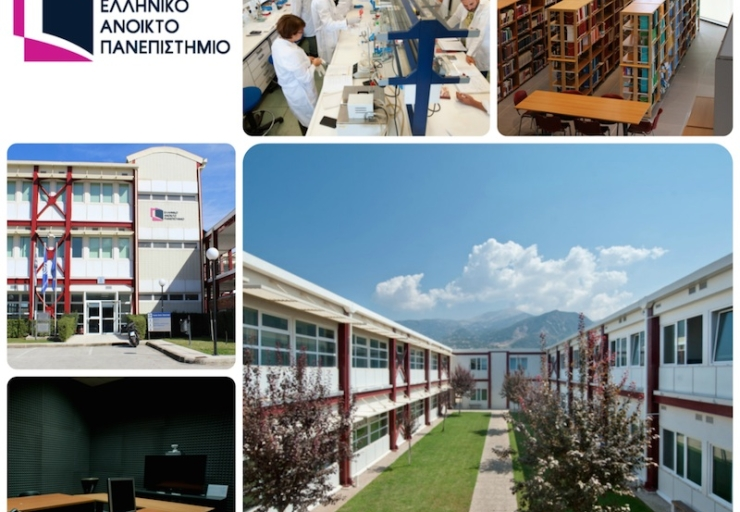

Hellenic Open University
---------------------------------------
 

<iframe src="https://www.google.com/maps/embed?pb=!1m18!1m12!1m3!1d3135.141841731376!2d21.768324176409426!3d38.20660348716708!2m3!1f0!2f0!3f0!3m2!1i1024!2i768!4f13.1!3m3!1m2!1s0x135e49d966693855%3A0x8a9e099fd55ba51a!2sHellenic%20Open%20University!5e0!3m2!1sen!2sgr!4v1738224438683!5m2!1sen!2sgr" width="100%" height="450" style="border:0;" allowfullscreen="" loading="lazy" referrerpolicy="no-referrer-when-downgrade"></iframe>

The international conference GTWC2027 will take place in Patras, Greece, from September 2 to 5, 2027, hosted at the state-of-the-art facilities of the Hellenic Open University.

Patras, the third largest city in Greece, is a pioneering and dynamic hub for research and innovation. The city hosts three universities and several research centers, contributing significantly to scientific and technological progress. Its port serves as a key transportation gateway to Italy and Central Europe.

Visitors will find a wide range of hotels and accommodations, as well as easy access to numerous beaches. Patras is also rich in cultural heritage, offering museums, archaeological sites, and landmarks that blend history with modern urban life. In addition, the city provides modern infrastructure in both networks and transportation, ensuring convenient access and a comfortable stay.

Further information on partner hotels as well as the conference’s visits and activities program will be announced in May 2027.

{: width="100%" }

{: width="100%" }

{: width="100%" }

Hotels
------

The range of hotel prices and quality is very large in Patras. 
We will soon announce some hotels that GTWC has an agreement with in order to fix the price. 

