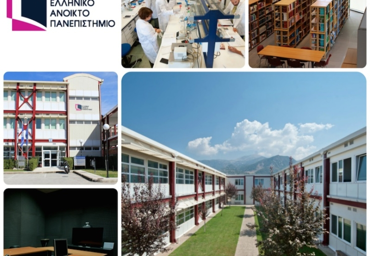

Hellenic Open University
---------------------------------------
 

<iframe src="https://www.google.com/maps/embed?pb=!1m18!1m12!1m3!1d3135.141841731376!2d21.768324176409426!3d38.20660348716708!2m3!1f0!2f0!3f0!3m2!1i1024!2i768!4f13.1!3m3!1m2!1s0x135e49d966693855%3A0x8a9e099fd55ba51a!2sHellenic%20Open%20University!5e0!3m2!1sen!2sgr!4v1738224438683!5m2!1sen!2sgr" width="100%" height="450" style="border:0;" allowfullscreen="" loading="lazy" referrerpolicy="no-referrer-when-downgrade"></iframe>

{: width="100%" }

{: width="100%" }

{: width="100%" }
height="250"

Hotels
------

The range of hotel prices and quality is very large in Patras. 
We will soon announce some hotels that GTWC has an agreement with in order to fix the price. 

